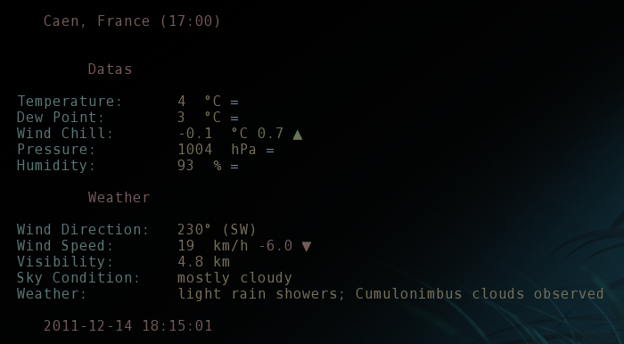

#Python Weather Station

Ncurses front-end for pymetar, gives the weather in console and keep
records, will gives graphics from the database obtain.

Curently under developpment.

##DEPENDENCIES

- pymetar
- urwid

##AUTHOR

Nicolas Paris <nicolas.caen@gmail.com>
site: http://www.nicosphere.net

##Licence

BSD Licence
